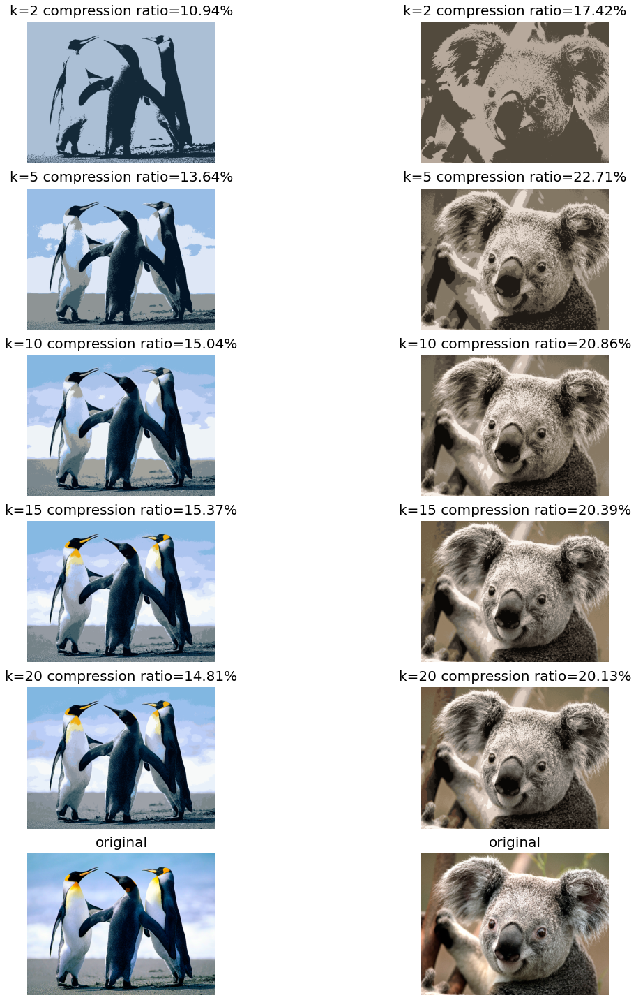

```python
from KMeans import kmeans_helper
import matplotlib.pyplot as plt
import numpy as np
import imageio
```


```python
k_arr = [2, 5, 10, 15, 20]
img_arr = ["Penguins.jpg", "Koala.jpg"]

plt.figure(figsize=(20,20))
for i, img in enumerate(img_arr, 1):
    for j, k in enumerate(k_arr, 0):
        rgb, ratio = kmeans_helper(img, k)
        plt.subplot(len(k_arr)+1, len(img_arr), len(img_arr)*j+i)
        plt.title(f"{k=} compression ratio={ratio*100:.2f}%", fontsize=20, verticalalignment="bottom")
        plt.axis('off')
        plt.imshow(rgb)
    plt.subplot(len(k_arr)+1, len(img_arr), len(img_arr)*len(k_arr)+i)
    plt.title(f"original", fontsize=20, verticalalignment="bottom")
    plt.axis('off')
    plt.imshow(imageio.imread(img))
plt.tight_layout()
plt.show()
```


    

    

